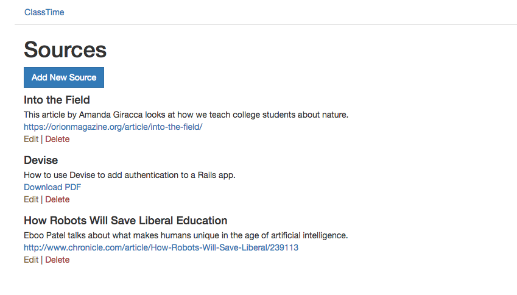

# ClassTime

### A learning management system for college courses.
### Built with Ruby on Rails.

Instructor view of sources, with ability to create, edit, delete, attach PDFs, and add links and YouTube videos.

