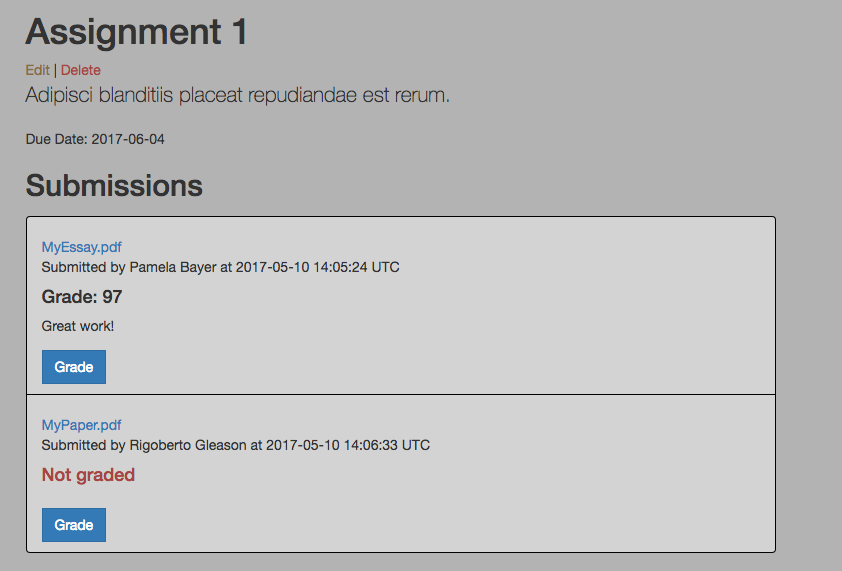

# ClassTime

## A learning management system for college courses (in progress).
## Built with Ruby on Rails.

### **Sources**

Instructors can:
* Create, edit, and delete sources
* Add links
* Attach PDF files (CarrierWave gem and Amazon S3 storage)
* Embed YouTube videos

**Instructor View**

### **Assignments**

Instructors can:
* View all student submissions for an assignment
* See if an assignment has been graded
* Add grades and written comments

**Instructor View**

