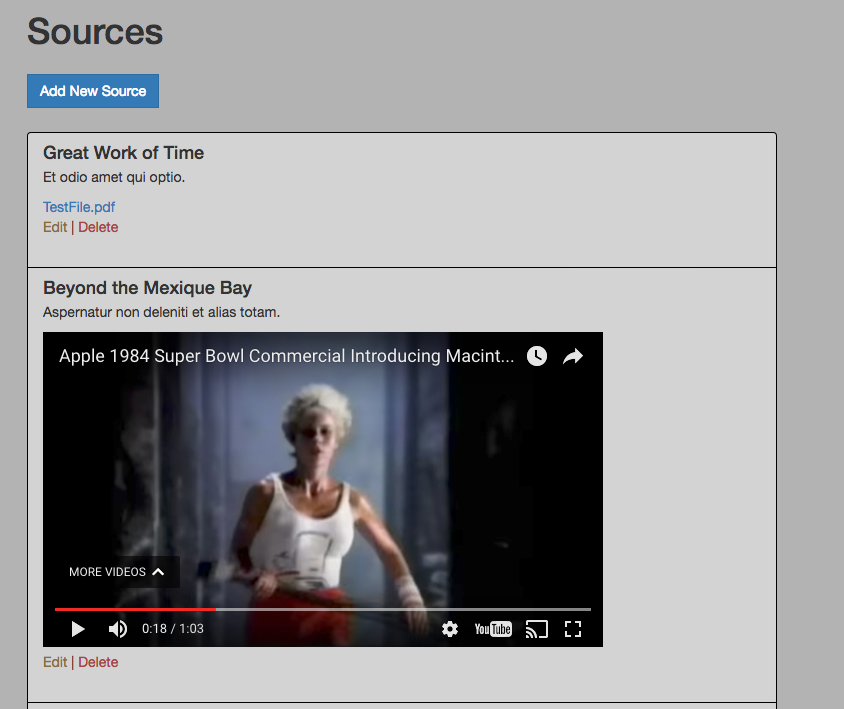
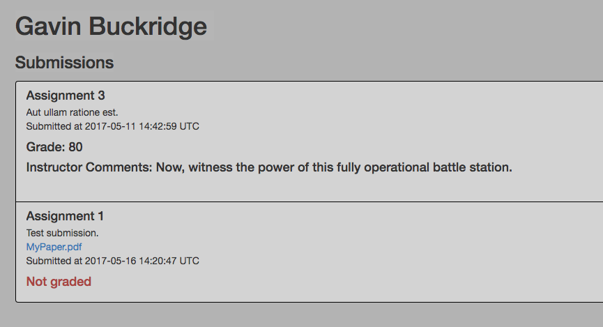

# ClassTime

## A learning management system for college courses (in progress).
## Built with Ruby on Rails.

### **Sources**

Instructors can:
* Create, edit, and delete sources
* Add links
* Attach PDF files
* Embed YouTube videos

**Instructor View**

### **Assignments**

Instructors can:
* View all student submissions for an assignment
* See if an assignment has been graded
* Add grades and written comments

**Instructor View**

### **Gradebook**

Instructors can:
* See which students have submitted assignments
* See grades for assignments that have been graded

### **Submissions**

Students can:
* View all their submitted assignments
* See grades and comments for assignments that have been graded

**Student View**

